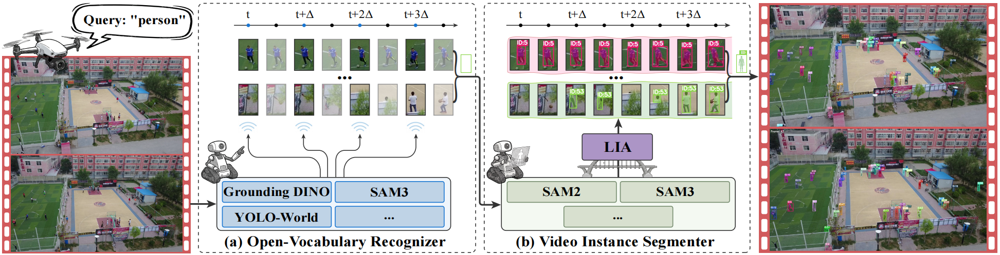
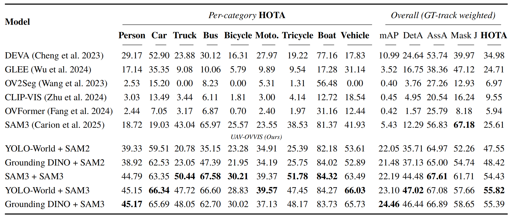
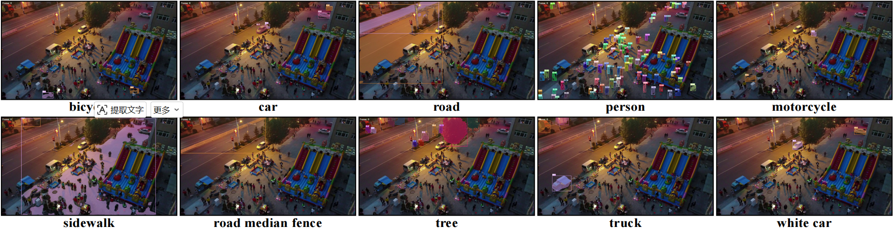

# AeroTrack

**AeroTrack** provides **five training-free** open-vocabulary tracking pipelines for UAV videos (BL2–BL6). Given a text prompt, an open-vocabulary detector (Grounding DINO / YOLO-World / SAM3) finds targets at key frames; SAM2/SAM3 propagates masks over time; lifecycle-aware association (LIA) keeps track IDs stable.

<p align="center">
  
</p>

Benchmark: **AeroVIS** (UAV-OVVIS), a YTVIS-style open-vocabulary video instance segmentation dataset for aerial scenes.
<p align="center">
  <video src="Image/UAV-OVVIS.mp4" width="96%" controls autoplay loop muted playsinline></video>
</p>

<p align="center">
  
</p>

<p align="center">
  
</p>

**Setup:** [INSTALL.md](INSTALL.md)

## Demo

`--baseline` selects BL2–BL6; `--text` is a short open-vocabulary prompt. A **single word** needs no quotes (e.g. `vehicle`); **multi-word phrases** should be quoted (e.g. `"road median fence"`, `"person riding bicycle"`).

```bash
python demo_video.py --baseline 2 --video <video_or_frame_dir> --text vehicle --output outputs/
python demo_video.py --baseline 2 --video <video_or_frame_dir> --text "road median fence" --output outputs/
```

| BL | Training-free pipeline |
| :--- | :--- |
| BL2 | SAM3 + SAM3 |
| BL3 | YOLO-World + SAM3 |
| BL4 | GroundingDINO + SAM3 |
| BL5 | YOLO-World + SAM2 |
| BL6 | GroundingDINO + SAM2 |

## AeroVIS

```text
data/AeroVIS/
├── aero_vis.json
└── sequences/
```

**Download:** [Google Drive](https://drive.google.com/file/d/1DMLagGZMPntrvxk5W0PsaIoybsE7WX56/view?usp=drive_link) (~12.6 GB, extract to `data/AeroVIS/`)

Categories and format: [data/AeroVIS/data.md](data/AeroVIS/data.md)

## Evaluation

Evaluate on the **AeroVIS** benchmark. `--baseline` supports **BL2–BL6** (five training-free pipelines). `--text` selects one of **9 categories**:

`person` · `car` · `truck` · `bus` · `bicycle` · `motorcycle` · `tricycle` · `boat` · `vehicle`

One category:

```bash
python evaluate.py --baseline 2 --text car --output outputs/bl2/car
```

All categories:

```bash
python evaluate.py --baseline 4 --output outputs/bl4
```

Useful flags: `--nooutput` skips visualization; `--json <predictions.json>` recomputes metrics only.

During evaluation, per-category tuning is loaded from `configs/categories/<category>.yaml`.

## Project Structure

```text
.
├── aerotrack_core/           # Core tracking, model, and evaluation modules
├── configs/
│   ├── baselines/            # BL1-BL6 baseline YAML configs
│   └── categories/           # Per-category tracking/detector tuning for evaluation
├── data/AeroVIS/             # AeroVIS dataset description and expected data layout
├── demo_video.py             # Video/frame-sequence demo entry point
├── evaluate.py               # Benchmark evaluation entry point
├── INSTALL.md                # Environment and checkpoint setup
└── requirements.txt          # Common Python dependencies
```

## Notes

- This repository does not include large model checkpoints.
- AeroVIS data files are distributed separately via Google Drive.
- AeroVIS annotation terms are described in [data/AeroVIS/data.md](data/AeroVIS/data.md).

## Citation

If AeroTrack or AeroVIS is helpful to your research, please cite our paper:

```bibtex
@article{dou2026uavovvis,
  title={UAV-OVVIS: Unmanned Aerial Vehicles Also Need Open-Vocabulary Video Instance Segmentation},
  author={Dou, Mingyu and Qiu, Shi and Hu, Ming and Chen, Yifan and Sun, Zhe},
  journal={arXiv preprint arXiv:2607.08075},
  year={2026}
}
```

Paper: [arXiv:2607.08075](https://arxiv.org/abs/2607.08075)

## Acknowledgments

**Code.** This project builds upon the following open-source works:

- [SAM3](https://github.com/facebookresearch/sam3)
- [SAM2](https://github.com/facebookresearch/sam2)
- [Grounding DINO](https://github.com/IDEA-Research/GroundingDINO)
- [YOLO-World](https://github.com/AILab-CVC/YOLO-World)

**Data.** AeroVIS is constructed from the following public UAV datasets:

- [VisDrone](https://github.com/VisDrone/VisDrone-Dataset)
- [UAVDT](https://sites.google.com/view/grli-uavdt)
- [SeaDronesSee](https://github.com/Ben93kie/SeaDronesSee)
