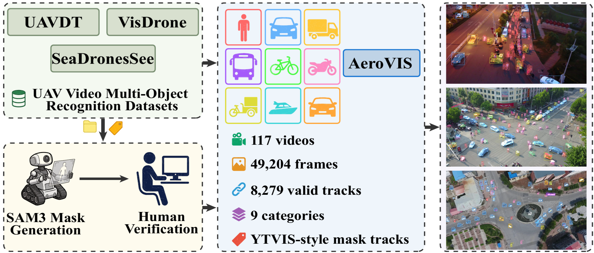

# AeroVIS

Benchmark for **UAV Open-Vocabulary Video Instance Segmentation (UAV-OVVIS)**.

<p align="center">
  
</p>

<p align="center">
  <b>VisDrone · SeaDronesSee · UAVDT</b> &nbsp;→&nbsp; <b>SAM3 + Manual Review</b> &nbsp;→&nbsp; <b>AeroVIS</b>
</p>

<p align="center">
  117 videos · 49,204 frames · 8,279 tracks · 9 categories · YTVIS-style mask tracks
</p>

---

## Download

[Google Drive](https://drive.google.com/file/d/1DMLagGZMPntrvxk5W0PsaIoybsE7WX56/view?usp=drive_link) (~12.6 GB). Extract to `data/AeroVIS/`.

```text
data/AeroVIS/
├── aero_vis.json
├── sequences/{video_name}/{frame}.jpg
└── data.md
```

## Evaluation

```bash
python evaluate.py --dataset aero_ovts \
  --gt_json data/AeroVIS/aero_vis.json \
  --seq_root data/AeroVIS/sequences
```

## Categories

| ID | Category | Tracks | ID | Category | Tracks |
|---:|---|---:|---:|---|---:|
| 1 | person | 2,413 | 6 | motorcycle | 663 |
| 2 | car | 2,967 | 7 | tricycle | 269 |
| 3 | truck | 149 | 8 | boat | 41 |
| 4 | bus | 47 | 9 | vehicle | 1,446 |
| 5 | bicycle | 284 | | | |

> `car` (VisDrone, fine-grained) and `vehicle` (UAVDT, coarse-grained) are evaluated separately.

## Format

`aero_vis.json` follows the YTVIS protocol: per-track `bboxes`, RLE `segmentations`, `areas`, and `track_id`. `iscrowd=1` annotations (80) are excluded from primary evaluation.

## License

AeroVIS annotations are released for **academic research and non-commercial use only**. Commercial use is not permitted without prior permission. Frame images are derived from the source datasets below; users must also comply with the licenses and terms of those datasets when using or redistributing the data.

## Citation

If you use AeroVIS, please cite our paper:

```bibtex
TODO
```

## Acknowledgments

AeroVIS is built upon the following public UAV datasets. We thank the authors for making their work available:

| Dataset | Official Link |
|---|---|
| VisDrone | https://github.com/VisDrone/VisDrone-Dataset |
| UAVDT | https://sites.google.com/view/grli-uavdt |
| SeaDronesSee | https://seadronessee.cs.uni-tuebingen.de |
